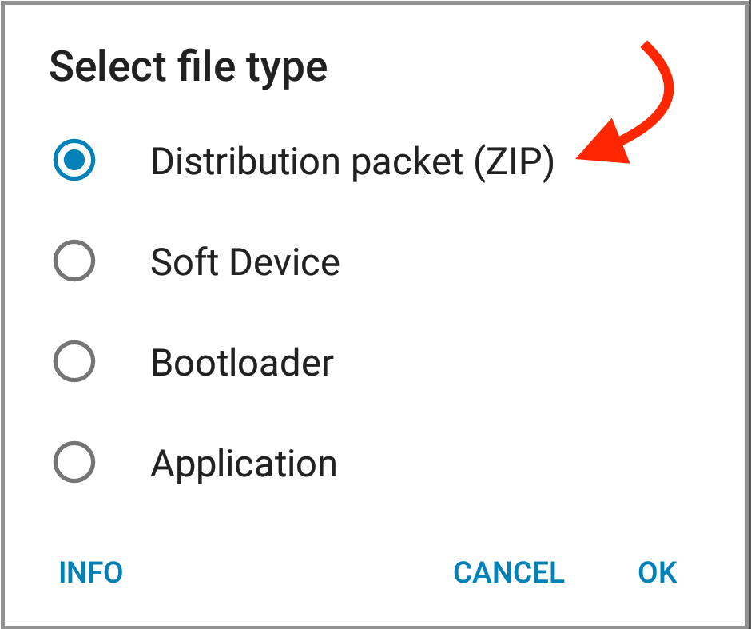

# Update OpenHAK Firmware
  
### Welcome! I'm going to guide you through the process to upload new firmware to your OpenHAK. We'll use our latest release as an example. It's pretty simple, but there's some steps involved. 

### **NOTE:** Images below from an Android phone. iPhone images coming soon!

## Step One

### Downlad out latest release to your phone, [OpenHAK 0.0.4](https://github.com/OpenHAK/OHAK_firmware/blob/master/Release_0.0.4.zip).

### If you have trouble, you can also email the zip file to yourself, and store it on your phone. The hardest part about this step is making sure that once you download the .zip you can find it.

## Step Two
### Download the nRF Toolbox app from your favorite app store. A direct search for `nRF Toolbox` should bring it right to you. This app has the ability to connect to your OpenHAK and do all kinds of things, including Device Firmware Update (DFU). Once it downloads, open it up. On first launch, you'll get asked to let the app access stuff on your phone. Just say yes to that. The main screen of the app offers you some tools to choose from. Choose DFU to continue this guide. 

 

### Now it's time to go find the .zip file of our software release. The app will ask you what you're doing. Tell it that you're sending a 'Distribution packet (ZIP)', then press OK,

### I found My file in the Downloads folder of my Pixel.

### The next prompt is to Select scope. Make sure that `All` is selected, then press OK.

The app will show you the file you just selected and all the settings. If you made a mistake, tap `SELECT FILE` go go a'hunting. Once you have the correct file loaded, it's time to select the device. Tap the button on the bottom of the screen.

### The next screen shows a list of availble devices. Your OpenHAK should be listed. If not, make sure that any other apps have disconected from it. Tap on the listing to connect to it.

### The last step is to upload the firmware. Tap the `Upload` button.

### Uploading will happen. When it's done, you can run the OpenHAK app and connect to your OpenHAK.

### Step 2 was kinda long but that's basically it!

