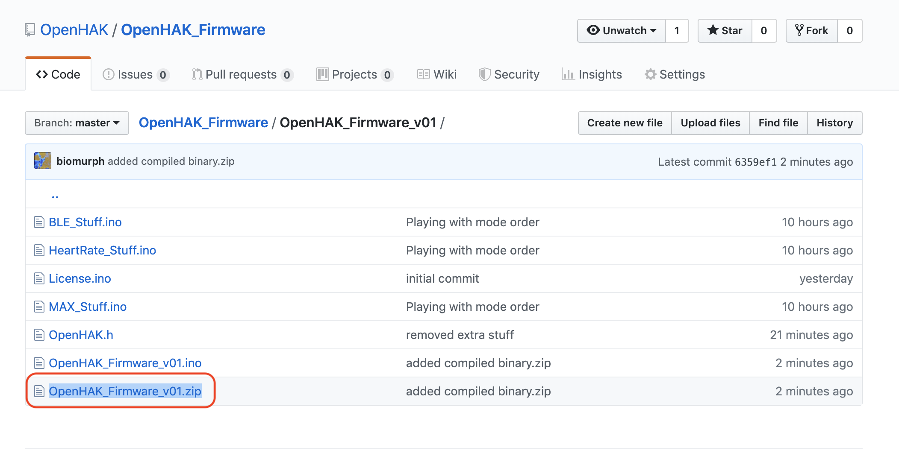
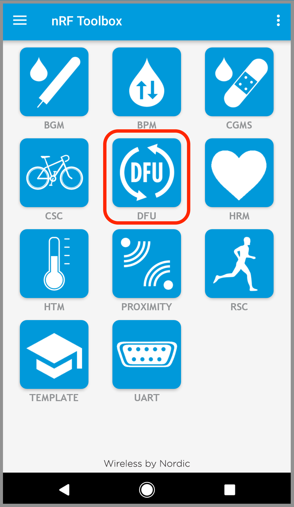
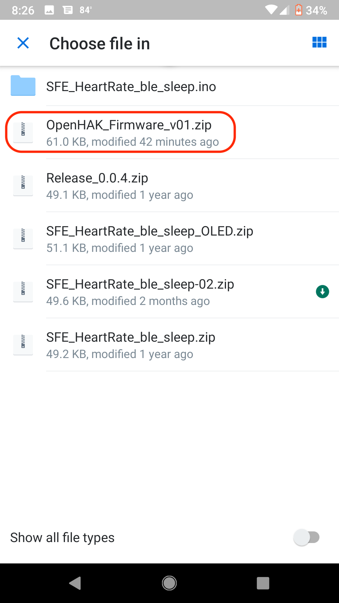

# Update OpenHAK Firmware
  
### Welcome! I'm going to guide you through the process to upload new firmware to your OpenHAK. We'll use our latest release as an example. It's pretty simple, but there's some steps involved. 

### Video showing OTA firmware using Android: https://youtu.be/99FAGOL7Lco

### Video showing OTA firmware using iOS: https://youtu.be/hfw3FGN5gXY

### **NOTE:** Images below from an Android phone. iPhone images coming soon!

## Step One

### Downlad out latest release to your phone, [OpenHAK 0.1](https://github.com/OpenHAK/OpenHAK_Firmware/blob/master/OpenHAK_Firmware_v01/OpenHAK_Firmware_v01.zip)

### If you have trouble, you can also email the zip file to yourself, and store it on your phone. The hardest part about this step is making sure that once you download the zip you can find it wherever the phone-thing has saved it to.

## Step Two
### Download the nRF Toolbox app from your favorite app store. A direct search for `nRF Toolbox` should bring it right to you. This app has the ability to connect to your OpenHAK and do all kinds of things, including Device Firmware Update (DFU). Install the app, and open it up. On first launch, you'll get asked to let the app access stuff on your phone. Just say yes to that. Once you launch it, the main screen of the app offers you some tools to choose from. Choose DFU to continue this guide. 

### Now it's time to go find the .zip file of our software release. First, the app will ask you what you're doing. Tell it that you're sending a `Distribution packet (ZIP)`, then press OK.

### I found My file in a DropBox folder on my Pixel. It's a handy place to store things. The Toolbox app seems to remember the last file you opened from, so it's good to keep your files tidy.

### The next prompt is to Select scope. Make sure that `All` is selected, then press OK.

### The app will show you the file you just selected and all the settings. If you made a mistake, tap `SELECT FILE` to go a'hunting. Once you have the correct file loaded, it's time to select the device. Tap the button on the bottom of the screen.

### The next screen shows a list of availble devices. Your OpenHAK should be listed. If not, make sure that any other apps have disconected from it. Also, if there are other OpenHAKs nearby that are advertising, you'll see them too. Each OpenHAK has a unique 4-hexadecimal name. In this example, it's `78F8` Once you know yours, try not to forget it. Tap on the listing to connect.

### The last step is to upload the firmware. Tap the `Upload` button.

### Uploading will happen. When it's done, you can run the OpenHAK app and connect to your OpenHAK.

### Step 2 was kinda long but that's basically it!

# What Happens If You Brick Your OpenHAK
### More than likely, you haven't actually bricked your OpenHAK. More likely, you have failed to include the OTA bootloader library in your Arduino sketch.
	#include <ota_bootloader.h>
### Can't OTA if you don't have that. You can always access the OpenHAK via the breakout pins. We've broken out TX, RX, RESET, and GND on the Simblee so that you can connect an FTDI friend in need. Please open an issues tab in the appropriate repo for help if you need.

